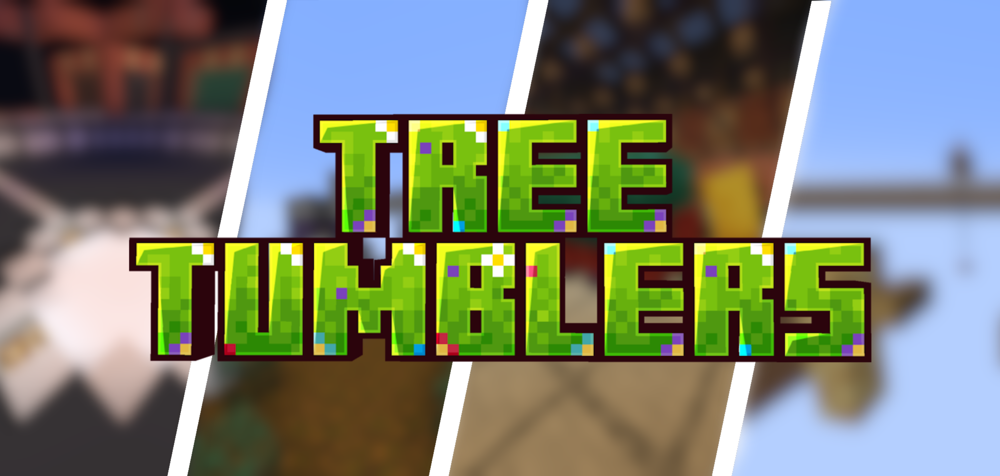
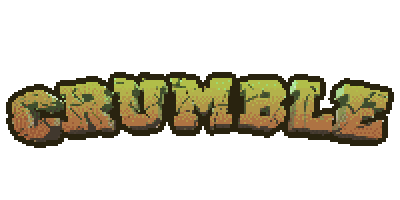
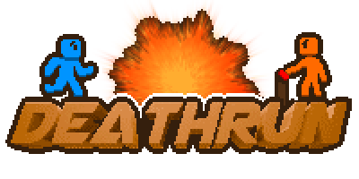
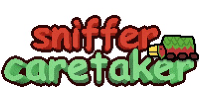
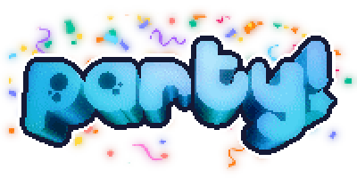

# Tree Tumblers
Tree Tumblers is a mcc-styled event plugin for 1.21.11 paper servers that allow teams to face in head-to-head games to determine the best among them.

The plugin adds a variety of games and an event system for playing these games in a loop. This system allows for players to play through all of the event games that are currently apart of the plugin (maximum of 8, depends on how many games are implemented in the version you have installed)

Not wanting to play with event mode? Just use the `/game start <name>` command to run a game sequence without it!

## Downloading
The plugin can be found on many distribution websites, including the [github releases tab](https://github.com/CmbsMinecraftPlugins/TreeTumblers/releases).

An in-dev build for the current commit can also be found in the [actions tab](https://github.com/CmbsMinecraftPlugins/TreeTumblers/actions)

*Some of these platforms may not display our plugin due to review backlogs. However, Hangar should always be up to date.*

- [Hangar](https://hangar.papermc.io/DevCmb/tree-tumblers)
- [Modrinth](https://modrinth.com/plugin/tree-tumblers)
- [CurseForge](https://legacy.curseforge.com/minecraft/bukkit-plugins/tree-tumblers)

## Developing
If you wish to contribute to the project, you're more than welcome to do so!

The project uses gradle as its build system, and sets up all the plugins using the `runServer` task, so all you need to do is import the project, run the `runServer` gradle task, and it'll host a local server for you to develop on.

This project also has support hot-swap debugging (although after errors it may not be as useful), running the debugger on the `runServer` task will allow you to make edits that get applied immediately.

## Games

### 
*Coded by DevCmb (@29cmb)*

Crumble is a team-based pvp game where teams fight in head-to-head matchups over the course of 7 rounds. Each team faces each other team once.

In the pregame, players are given a kit selector to pick from 1 of 8 kits. Each has a unique loadout, kill power, and 1-time use ability that can be used one time per round.

The kits you can pick from are:
- Archer
- Bomber
- Fisher
- Hunter
- Ninja
- Sorcerer
- Warrior
- Worker

In game, each kit has a little section describing the ability and kill power.

The game was originally designed by [MatMart](https://www.youtube.com/@MatMart), coded by [BlackilyKat](https://blackilykat.dev/), and funded by [GD Cob](https://www.youtube.com/@Cobgd), who gave us permission to use the concepts in the game!

### 
*Coded by DevCmb (@29cmb)*

Deathrun is a parkour face-off where a team of trappers faces off against the rest of the game as runners. Trappers have access to traps which can kill or make the path harder to traverse. 

Scoring for trappers is based on damage and kill, while runner score is solely based on completion placement (better placement = more score)

There are 8 rounds, 1 for each team, where each gets a chance as the trappers. Trappers can trigger traps that aren't on cooldown, and every trap has a cooldown of about 15s (depends on the trap).

### 
*Coded by Nibbl_z (@Nibbl-z)*

Sniffer Caretaker is a teamwork oriented minigame where you need to tend to your team's sniffer. It will request different tasks that you need to complete in order to gain score. Each task has a certain amount of stars, which determines the amount of score you get.

Tasks range from:
- Feeding the sniffer food, such as bread, mushroom stew, pumpkin pie, or cake
- Quenching the sniffer's thirst, either with milk or water
- Giving the sniffer blocks to sniff, such as dirt, moss, or... glass?
- Bringing a friend to the sniffer's pen!

Team coordination is key in this game to make the sniffer as happy as possible, which in turn will crown you the winner!

### 
*Coded by DevCmb (@29cmb)*

Party is a fast-paced minigames game where you fight in solo and team minigames.

For the first 5m of the game, players will fight head-to-head in individual minigames (1v1). After these finish, for the last 5m of the game, you will fight in team minigames against an opposing team.

This game uses a matchmaker to give players new matches as quick as possible (while trying to minimize playing against the same person twice)

### Breach
*Coded by Nibbl_z (@Nibbl-z)*

Breach is the high-stakes finale game for the event, in which the 1st and 2nd place teams compete against eachother to determine who are the best players of all.

Each round, you can pick to use either a bow, crossbow, or trident. One player on each team also needs to hold the star.

All players are spawned in with half a heart, meaning any attack will instantly kill. Teams need to keep the holder of the star safe, while at the same time attempting to kill the other team's star holder, in order to steal it. Stealing the other teams star awards you a win for that round.

Whichever team wins 3 rounds first, is the winner.

## AI Disclosure
AI was used for pull request review and some debugging. It was NOT used for major features, and any AI code is declared with a comment.

All assets are **human made** by Nibbl_z, DevCmb, and TheMasked_Panda