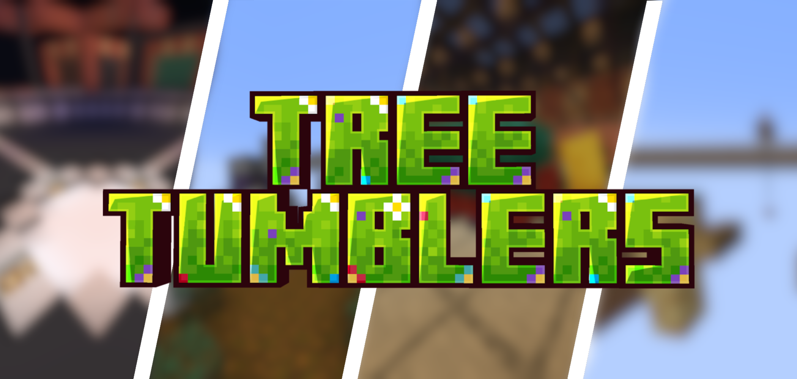
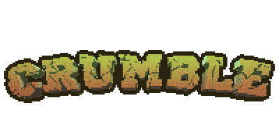
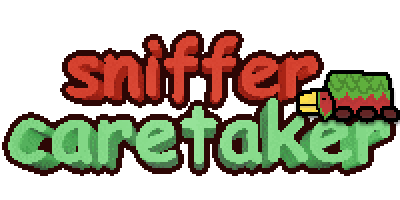
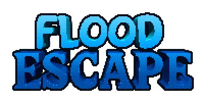
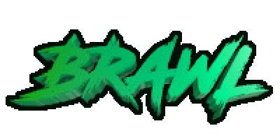
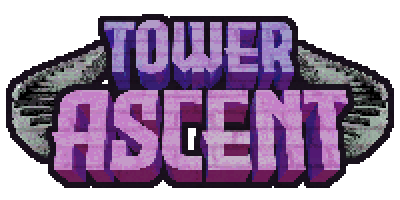
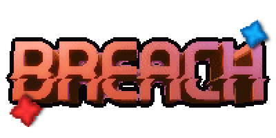

Demo video: https://youtu.be/WFtXUpfsdHM

v1.1 update video: https://www.youtube.com/watch?v=3YfonhaBqHg

# Tree Tumblers

Tree Tumblers is a mcc-styled event plugin for 26.1.2 paper servers that allow teams to face in head-to-head games to determine the best among them.

The plugin adds a variety of games and an event system for playing these games in a loop. This system allows for players to play through all of the event games that are currently apart of the plugin (maximum of 8, depends on how many games are implemented in the version you have installed)

Not wanting to play with event mode? Just use the `/game start <name>` command to run a game sequence without it!

## Downloading

You need a lot of setup to use this plugin properly, so you can find an example server in the [releases tab!](https://github.com/CmbsMinecraftPlugins/TreeTumblers/releases) (all default config keys are for this)

If you want to go through setting up the plugin yourself, The plugin can be found on many distribution websites, including the [github releases tab](https://github.com/CmbsMinecraftPlugins/TreeTumblers/releases). Each config key has a comment above it that shows what it changes, and for templates, refer to the template server.

An in-dev build for the current commit can also be found in the [actions tab](https://github.com/CmbsMinecraftPlugins/TreeTumblers/actions)

- [Modrinth](https://modrinth.com/plugin/tree-tumblers)

## Developing
If you wish to contribute to the project, you're more than welcome to do so!

The project uses gradle as its build system, and sets up all the plugins using the `runServer` task, so all you need to do is import the project, run the `runServer` gradle task, and it'll host a local server for you to develop on.

This project also has support hot-swap debugging (although after errors it may not be as useful), running the debugger on the `runServer` task will allow you to make edits that get applied immediately.

## Commands
When playing while you have op, you can use the following commands to control the games

`/game start <name>` - starts an individual game that **does not** advance the event state

`/event start [--confirm]` - starts the overall event loop that runs games. If you just want to mess around with the games, don't use this

`/game playercheck [skip | permaskip | unpermaskip]` - skips for one round or permanently skips the "Waiting for Players" dialog

`/game timer [number]` - Set the time on the current timer

`/timer pause [id]` - Pauses a timer by its ID (useful for games that have multiple timers)

`/event timer [pause | unpause | set]` - Interacts with the overall event in one of 3 ways

## Games

### 
*Coded by DevCmb (@29cmb)*

Crumble is a team-based pvp game where teams fight in head-to-head matchups over the course of 7 rounds. Each team faces each other team once.

In the pregame, players are given a kit selector to pick from 1 of 8 kits. Each has a unique loadout, kill power, and 1-time use ability that can be used one time per round.

The kits you can pick from are:
- Archer
- Bomber
- Fisher
- Hunter
- Ninja
- Sorcerer
- Warrior
- Worker

In game, each kit has a little section describing the ability and kill power.

The game was originally designed by [MatMart](https://www.youtube.com/@MatMart), coded by [BlackilyKat](https://blackilykat.dev/), and funded by [GD Cob](https://www.youtube.com/@Cobgd), who gave us permission to use the concepts in the game!

### 
*Coded by Nibbl_z (@Nibbl-z)*

Sniffer Caretaker is a teamwork oriented minigame where you need to tend to your team's sniffer. It will request different tasks that you need to complete in order to gain score. Each task has a certain amount of stars, which determines the amount of score you get.

Tasks range from:
- Feeding the sniffer food, such as bread, mushroom stew, pumpkin pie, or cake
- Quenching the sniffer's thirst, either with milk or water
- Giving the sniffer blocks to sniff, such as dirt, moss, or... glass?
- Bringing a friend to the sniffer's pen!

Team coordination is key in this game to make the sniffer as happy as possible, which in turn will crown you the winner!

### 
*Coded by DevCmb (@29cmb)*

Party is a fast-paced minigames game where you fight in solo and team minigames.

For the first 5m of the game, players will fight head-to-head in individual minigames (1v1). After these finish, for the last 5m of the game, you will fight in team minigames against an opposing team.

This game uses a matchmaker to give players new matches as quick as possible (while trying to minimize playing against the same person twice)

## 
*Coded by DevCmb (@29cmb)*

Flood Escape is a parkour challenge game where you have to escape an incoming flood with a variety of tools at your disposal.

With a randomly generated obstacle course before you, where each obstacle can give you either an elytra, riptide trident, or nothing at all, will you be able to outrun the flood?

Whoever can survive the longest is declared the winner.

## 
*Coded by DevCmb (@29cmb)*

Brawl is a kit-based team battle game where the goal is to simply survive.

Before each round, you'll be given a compass to choose between 4 randomly selected kits. Each kit brings a unique playstyle, from support to offensive.

You'll have to watch out for a border thats constantly shrinking around you, slowly pushing teams towards the center of the arena.

Whichever team has players alive at the end is the winner of the round.

##  
*Coded by DevCmb (@29cmb)*

Tower Ascent is a game where you have to climb to the top of a tower while fighting hoards of monsters in the various rooms you'll stumble across.

Killing these monsters gives you gold which can be used to buy things in a shop room, as well as being bankable at the end of the game for some bonus points. The shop items can improve your run in the long-term, but if you die once, you lose it all, so be careful!

Scoring is based on how fast your team completes the tower, so you can play it risky and try speedrunning, or play it safe and take your time.

### 
*Coded by Nibbl_z (@Nibbl-z)*

Breach is the high-stakes finale game for the event, in which the 1st and 2nd place teams compete against eachother to determine who are the best players of all.

Each round, you can pick to use either a bow, crossbow, or trident. One player on each team also needs to hold the star.

All players are spawned in with half a heart, meaning any attack will instantly kill. Teams need to keep the holder of the star safe, while at the same time attempting to kill the other team's star holder, in order to steal it. Stealing the other teams star awards you a win for that round.

Whichever team wins 3 rounds first, is the winner.

## AI Disclosure
AI was used for pull request review and some debugging. It was NOT used for major features, and any AI code is declared with a comment.

All assets are **human made** by Nibbl_z, DevCmb, and TheMasked_Panda
